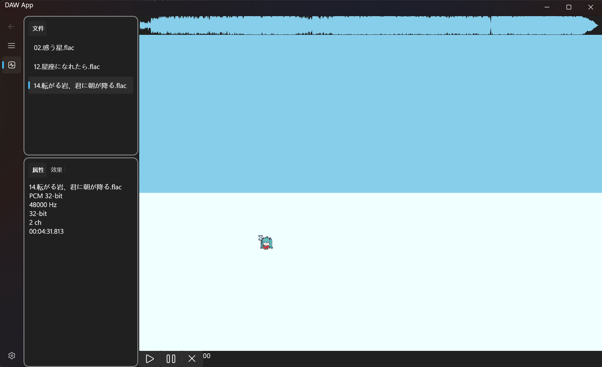

# 第一周

## 本周目标
- 搭建项目基础结构。
- 实现音频文件的加载与播放功能。
- 初步设计用户界面。

## 完成情况
- 已完成项目基础结构的搭建，包括主项目和子模块 `DAW.Wave`。
- 实现了音频文件的加载、播放、暂停和关闭功能。
- 初步完成了用户界面的设计，包含波形预览和文件列表。

## 遇到的问题
- 在实现音频波形预览时，内存占用极高，需优化。

## 下周计划
- 优化音频波形预览的性能。
- 增加音频文件的导出功能。
- 完善用户界面交互细节。

## 界面预览

