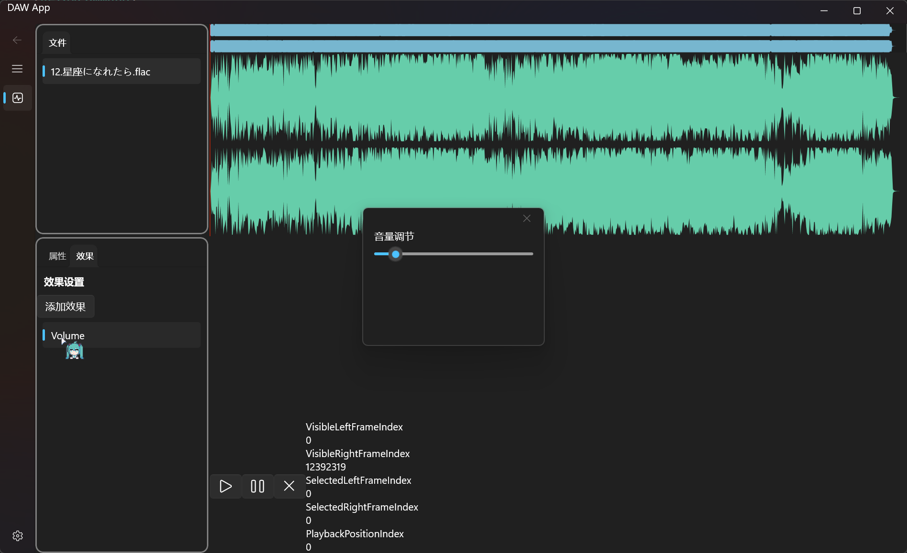

# 第二周

## 本周目标
- 添加特效功能并实现相关的可视化。
- 优化音频播放控制功能。
- 继续完善代码结构和模块化。

## 完成情况
- **效果器**：
  - 实现了 `EffectFactory`，支持添加新特效的功能
  - 实现并可视化了 `VolumeEffect`
- **代码优化**：
  - 重构了 `WaveService`，为添加音频特效提供必要的代码框架
- **用户界面改进**：
  - 为效果器添加了可视化界面

## 遇到的问题
- 在为 `WaveViewControl` 添加播放位置显示时，遇到画布渲染性能问题，需进一步优化。
- `EffectFactory` 的特效扩展性和可测试性尚需验证。

## 下周计划
- 优化 `WaveViewControl` 的画布渲染性能。
- 增加更多音频特效（如回声、均衡器等）。
- 优化代码结构，提升可维护性。

## 界面预览

